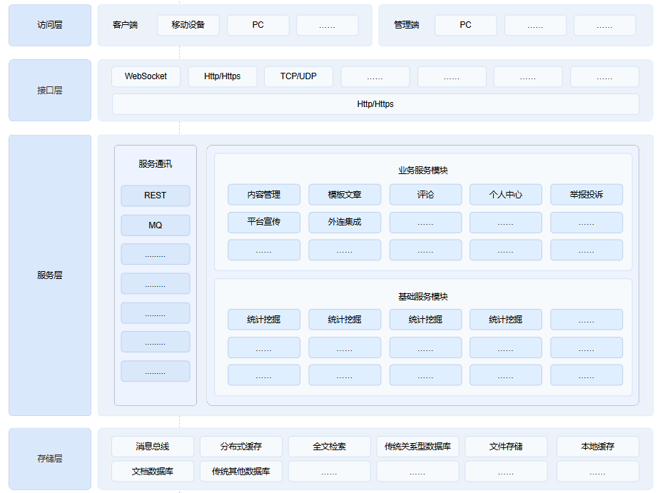
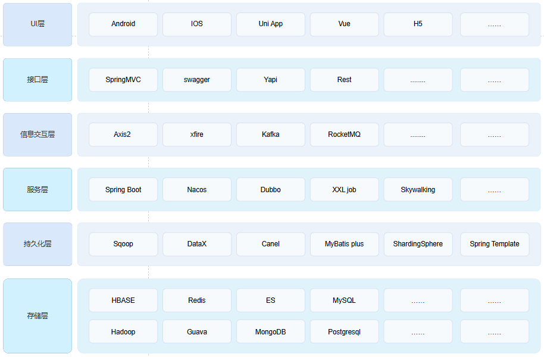

# 逻辑架构
逻辑架构图是用来描述系统中各个组件及其相互关系的图，它展示了系统内部的高层次结构而不考虑物理部署的细节，  
主要包括一下内容： 
组件识别： 识别系统中的主要组件，明确每个组件的职责和功能； 
组件交互：组件之间的接口和契约，描述组件之间的通信方式； 
逻辑层级：展示每一层的功能和职责；  
性能考虑：展示系统中的缓存机制；  

# 技术架构

技术架构图内容，这是一个多层的系统架构设计，它展示了不同层次的组件和它们所使用的技术； 
这是一个典型的现代IT系统， 它采用了多层架构模式，每一层都包含了一系列技术组件来支持不同的功能需求。  
从前端用户界面到后端服务、数据持久化和存储，这个架构提供了一个全面的技术栈概览，适用于构建大型、复杂的应用程序。  

