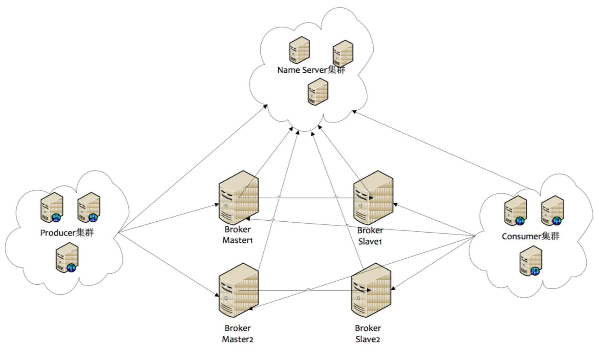

# ArchMain

[](https://www.apache.org/licenses/LICENSE-2.0) [](https://creativecommons.org/licenses/by/4.0/)

```
 
```

### 这是什么？

架构图模板介绍

本模板是一份融合了当前流行的4A架构理念与TOGAF（The Open Group Architecture Framework）架构框架的架构图模板。它汇集了我们团队凭借多年经验自主创造的成果，旨在提供一个全面的架构设计参考。模板内容包括：

* **系统逻辑架构图**：展示系统组件的逻辑关系和交互。
* **技术架构图**：描述构成系统的技术基础和相互作用。
* **数据架构图**：阐释数据管理和流动的结构。
* **部署架构图**：描绘系统在物理环境中的部署情况。



此外，还包括了遵循TOGAF标准的架构图，这些图表不仅可以在线查看，还提供原文件下载功能。我们鼓励并支持您将这些架构图直接应用于实际工作中，以提升工作效率。

**文档撰写目的**

我们编写这份文档，基于以下几点目的：

* **经验分享**：我们的团队在长期的架构设计实践中积累了宝贵的经验，希望通过本文档系统性地整理并分享给架构师同行。
* **能力提升**：我们发现许多架构师对现有架构图的理解不够深入。本文档旨在帮助他们加深理解，增强实战技能。
* **样式统一与美化**：若您公司的架构图样式存在不统一或美观度不足的问题，可以参考我们的架构模板。本模板经过专业人士美化，以确保专业性与视觉吸引力。

我们期望这份架构图模板不仅能作为一份参考资源，更能成为提升架构设计质量和效率的工具。

### 如何使用？

根据“使用”的所指含义的不同，笔者列举以下几种情况：

* **在线阅读**：本文档在线阅读地址为：[https://github.com/SoftArchLizh/ArchIdeology/tree/main](https://github.com/SoftArchLizh/ArchIdeology/tree/main)。\
  网站由 [GitHub Pages](https://pages.github.com/) 提供网站存储空间；&#x20;

&#x20;     在线阅读地址： [https://softarchlizh.gitbook.io/softarchmain](https://softarchlizh.gitbook.io/softarchmain)


*   **离线阅读**：


    * 下载到本地：请使用如下命令：


    ```bash
    # 克隆获取源码
    $ git clone  https://github.com/SoftArchLizh/ArchIdeology.git  

     
    ```


    *   打开项目查看：

        &#x20;

&#x20;                        1、   打开draw.io 或  https://app.diagrams.net  ,  选择原文件   &#x20;

<div align="center">

<figure><figcaption></figcaption></figure>

</div>

&#x20;                 &#x20;

&#x20;                    2、查看  架构原文件 ， 调整0731

&#x20;                        &#x20;

<figure><figcaption></figcaption></figure>

&#x20;                &#x20;


* **传播和发行**：本文档中所有的内容，如引用其他资料，均在文档中明确列出资料来源，一切权利归属原作者。除此以外的所有内容，包括但不限于文字、图片、表格，等等，均属笔者原创，这些原创内容，笔者声明以[知识共享署名 4.0](http://creativecommons.org/licenses/by/4.0/)发行，只要遵循许可协议条款中**署名**、**非商业性使用**、**相同方式共享**的条件，你可以在任何地方、以任何形式、向任何人使用、修改、演绎、传播本文档中任何部分的内容。详细可见本文档的“协议”一节。
* **分类查看**：你可以通过下面所列的地址，查看到本文档所有工程代码和在线演示的地址：
  * 文档工程：
    *
    *
  * 前端工程：
    * Mock.js 支持的纯前
    *

### 协议

* 本作品代码部分采用 [Apache 2.0协议](https://www.apache.org/licenses/LICENSE-2.0)进行许可。遵循许可的前提下，你可以自由地对代码进行修改，再发布，可以将代码用作商业用途。但要求你：
  * **署名**：在原有代码和衍生代码中，保留原作者署名及代码来源信息。
  * **保留许可证**：在原有代码和衍生代码中，保留Apache 2.0协议文件。
* 本作品文档部分采用[知识共享署名 4.0 国际许可协议](http://creativecommons.org/licenses/by/4.0/)进行许可。 遵循许可的前提下，你可以自由地共享，包括在任何媒介上以任何形式复制、发行本作品，亦可以自由地演绎、修改、转换或以本作品为基础进行二次创作。但要求你：
  * **署名**：应在使用本文档的全部或部分内容时候，注明原作者及来源信息。
  * **非商业性使用**：不得用于商业出版或其他任何带有商业性质的行为。如需商业使用，请联系作者。
  * **相同方式共享的条件**：在本文档基础上演绎、修改的作品，应当继续以知识共享署名 4.0国际许可协议进行许可。

### 备案 <a href="#bei-an" id="bei-an"></a>

网站备案信息：[粤ICP备](http://beian.miit.gov.cn/)
